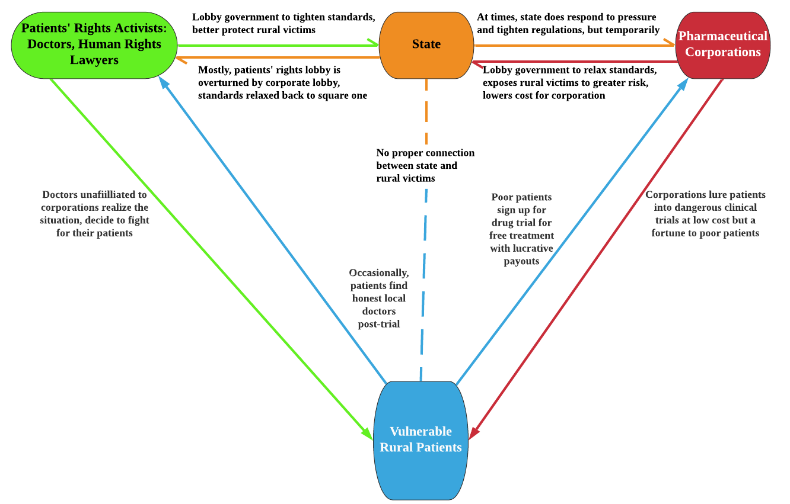

## INTRODUCTION

Today, production networks have become increasingly decentralized due to globalization. 
One key method that global corporations use to diffuse their production process is outsourcing. 
At times, such outsourcing could take on a more sinister form; with the outsourcing of clinical trials for experimental pharmaceutical therapies in rural villages being one of the most negligent. 
Termed “clinical labor” (Cooper & Waldby, 2014), it is part of a broad category of paid civilian participation in medical enterprises, including tissue sample donation and commercial surrogate pregnancies. 
Yet not all such experimental projects are equally safe or benign; making recruitment for experimental therapies difficult. 
The vocabulary of “labor”, characterizing this as merely another form of employment, unfortunately, overlooks this crucial fact. 
This incentivizes pharmaceutical companies to seek alternative testing grounds in the developing world, where weak regulations give them freer reign. 
India (and recently, a rising China), has emerged as the top destination for such trials (ibid). 
This study explores how these companies have been able to exploit rural villagers who participate in these trials and often evade legal repercussions for the unethical conduct of trials and human rights violations, due to the policies of the Indian government.

## INDIA: DOMESTIC CONTEXT

The second most populous country, India has long struggled with sharing the benefits of economic development over its vast territory and population. 
Uneven development has created pockets of well-developed urban areas (mostly in the capital cities of each state), punctuating large swaths of undeveloped rural land.
Infrastructural development is also severely lacking in these areas, with little access to education or English literacy, and modern allopathic medicine. 
Coupled with a genetic predisposition that places South Asians at higher risk of chronic diseases such as diabetes, cardiovascular disease, and hypertension, this creates a very diseased demographic in rural India; (Nundy & Gulhati, 2005). 
The country currently has at least “40 million asthmatic patients, 34 million diabetics [and] 8-10 million HIV positive [patients]” (Prasad, 2009). 
Poor health further limits their ability to adequately provide for their families.

A significant majority of these impoverished groups work in low-wage agriculture or other small enterprises in the informal sector. 
To these vulnerable individuals living in unsanitary conditions, exposed to numerous vectors of disease on a daily basis, healthcare comes at a highly prohibitive premium, many times more than their annual income. 
Short life expectancy has become internalized by the people living in many of these regions, with few ever contemplating seeking professional medical attention upon developing any conditions (Nundy & Gulhati, 2005). 
A significant portion of this medically underserved population is concentrated in Southern India, although similar patterns can be observed in the North as well (ibid.).

## FILLING A MISSING MARKET

Thus, in light of the above characteristics, the allure of using India as an efficient and abundant mine for human test subjects is clear. 
Specifically, there are three integral reasons for this. 
First, the patient population per disease is much larger than in the home countries of these pharmaceutical companies, giving them much more diverse samples for testing. 
Second, as these populations rarely get medical help, they are unlikely to be undergoing concurrent treatments for other diseases or co-morbidities that may arise alongside the main disease being researched. 
This makes them the perfect population for both intervention and control cohorts for the randomized trials (Shah, 2006; Prasad, 2009). 
Third, and most disturbingly, these people are chosen because of their illiteracy and inability to understand their medical situation, such that the risks of the trial can be downplayed or not fully communicated (Bahri, 2016). 
As such, these patients are not truly capable of articulating fully informed consent. 
Many may not even be able to sign their own name, relying on thumbprints instead, which creates more loopholes that can be exploited to forge uninformed consent (ibid). 
These patients are also less likely to demand compensation in case of medical malpractice (Bagcchi, 2015), making them a population of “docile bodies” that are available as test specimens for pharmaceutical companies at low cost, with reduced need to place safeguards to ensure long-term patient welfare.

From the patients’ perspective, this model resolves many of the barriers that deter them from seeking medical help; as these clinical trials present a rare and unique opportunity for patients coping with prolonged illness to receive treatment at no cost - and even get paid for it (Kamat, 2014). 
The compensation for participation in these drug trials is limited, paying about 10 USD per day of hospitalization (Shah, 2006; Bahri, 2016). 
However, to a rural farmhand, this may well exceed the daily wage of about 20 cents per day, at 50 times his normal compensation. 
This makes participation in such underpaid clinical trials a very lucrative possibility for an illiterate villager, with the added benefit of (allegedly) attending to their own healthcare needs. 
These pharmaceutical companies often operate by proxy through other “Contract Research Organizations” (CROs), which employ local doctors from neighboring cities as agents to recruit participants from the villages. 
The use of local recruiters has two underlying reasons. On the surface, it improves the patient accrual rate by transcending the language barrier (Kamat, 2014).

But it is the second reason which reveals the sinister nature of these operations. 
Due to India’s colonial history and silent admiration for Western cultural exports, many rural villagers hold Western-trained physicians in very high regard. 
In being granted the rare opportunity to be treated by a doctor in Western attire and a lab coat, patients often imagine that they are in the presence of an infallible authority (Bahri, 2016). 
This preys on the villagers’ deeply held notions of doctors as lifesavers equivalent to gods - as authorities not to be questioned but instead revered with gratitude for trying to heal them. 
With this cultural backdrop, rural test subjects are quick to accept that the doctors did the best they could, blaming any untoward outcomes on their own fate, leading to a much lower likelihood of legal action against unethically conducted trials. 
The high incidence of human rights violations and deviations from accepted standards of medical ethics is a direct consequence of these ground conditions (Prasad, 2009). 
Most troublingly, it leaves many patients with long-term impairments or organ damage from the side-effects of the untested drugs, sometimes even taking their lives.

The confluence of these factors leads to much greater efficiency in conducting drug trials in India. 
Not only are trials operationalized and completed much more promptly than in developed nations, but firms also enjoy cost savings in reduced legal liabilities and lower compensation fees for all participants. 
Taken cumulatively, conducting a trial in India is about 8.5 times more efficient than researching therapies for the same disease in Europe (Prasad, 2009). 
Clearly, many pharmaceutical companies have sought to capitalize on these conditions, with all of the major players in the global pharmaceutical oligopoly - Novartis, AstraZeneca, GlaxxoSmithKline, and others having significant research and development presences in India (Shah, 2006).

## STATE BIOPOLITICS AND NEOLIBERAL CITIZENSHIP IN INDIA

These lucrative conditions are sustained by an accompanying regulatory regime that allows such ethical violations. 
Despite these abuses, the economic benefits of partnering with the pharmaceutical oligopoly are too lucrative for the state to pass up (Prasad, 2009). 
The drug discovery sector boasts an annual growth rate of 6% globally, with India’s domestic market alone growing by 30% each year (ibid.). 
In 2013, the market value of such drug trials in India was estimated at 400 million USD, with steady growth rates projected (ibid). 
Faced with the possibility of being able to capitalize on such a market with little to no infrastructural investment required, the Indian Government seized the opportunity to open the countryside to Big Pharma (Sharma, 2004). 

Drug control laws were progressively relaxed, with significant reduction in regulations in 2009 (BioSpectrum, 2016), marking the first direct invitation to pharmaceutical corporations to conduct large scale testing in India (even though the practice had been occurring without overt state support from 2000). 
The burgeoning of outsourced drug trials greatly accelerated from the following year, nearly doubling between 2016 and 2017 alone. 
Under these relaxed regulations, processing times for trial permits were shortened, the required documentation to apply for trials was reduced, and firms were given significant autonomy in setting the compensation levels for civilian participation in their experiments (Chowdhury, 2013). 
This cemented the economic significance of pharmaceutical companies in the economy, becoming a source of power and influence for the corporations.

The state took various proactive steps to attract greater foreign investment from pharmaceutical giants. 
Perhaps the most direct and disturbing of these efforts was how the government began marketing its very diseased rural populations to global corporations. 
The dangerously high incidence of diseases began to be framed by the Indian government as “The India Advantage”, which further appealed to pharmaceutical companies to take advantage of all the unique “features” which made India a useful site for mass clinical trials (Prasad, 2009), instead of working to arrest the high chronic disease incidence by treating it as a public health failure.

Underlying this is a darker re-articulation of the social contract between the state and citizens. Under neoliberal logic, citizens are recast as economic resources for the state. 
Given that these individuals are not formally engaged in full-time employment, do irregular work, and do not contribute to tax revenue, but may often require state assistance when they sporadically engage with officials, they are welfare recipients. 
More accurately, they are now seen as being in debt with the Indian state. 
Allowing them to participate in clinical trials is taken as a way to make these economically unproductive, biopolitical debtors pay for their own subsistence through the higher payouts to the economy from the trials. 

The extent of the government’s commitment to commoditizing these citizens is further seen in the nature of the trials that dominate the Indian operations of firms. 
The majority of trials in India are Phase 1 trials, the very first usage of the candidate drug outside animal models (Shah, 2006). 
This exposes the Indian recipients to much higher risks to their health than their counterparts in more affluent economies, who are offered Phase 2 and 3 trials. 
While later trials are not free of risk, the chemical agent used is often better understood and refined to control for side effects detected in Phase 1 trials. 
This reveals the state’s willingness to use its most vulnerable citizens, themselves critically in need of quality medical care, as mere “bodies” - organ systems for chemicals to be tested on; while shielding the more affluent population within and outside the country from enduring side effects. 
Such a neoliberal reorientation of the state is made possible by how deeply these corporations have entrenched themselves as a low-cost, self-automated complement to the rural economy that the state could not afford to offend (ibid).

## PUSHING BACK: HUMAN RIGHTS ACTIVISM

As the trade in outsourced clinical trials continued to grow, there was a gradual increase in cases of patients finding that they were more unwell, or lost their lives, after the trial. 
A minority of these patients were able to find alternative medical care after such trials, where their attending physicians began to discover gross ethical violations. 
In some of the most extreme cases, patients had been given medicines completely unrelated to their condition, so that researchers could observe the effects on an unaffected organ, such as heart patients receiving liver disease drugs for researchers to study its effects on a healthy liver.

By 2014, various activist groups (largely tripartite alliances between victim families, their physicians, and legal experts), began to press the state to tighten regulations, offer better protections to patients, and enforce better compensation rates for victims (Pulla, 2014). 
In particular, civil society groups called for a repeal of the 2005 amendment to the Drugs & Cosmetics Regulations (DCR) Act, which empowered the Drug Controller General of India (DCGI) to waive the approval process for Phase 1 Human Trials. 
Since 2012, when the government began its open support of such trials, the DCGI has exercised discretion to authorize many trials, causing them to triple across that year alone. 
This clearly demonstrates the extent of influence the corporations have in making personal appeals to the authorities to grant expedient approvals, bypassing due process (Chowdhury, 2013).

Apart from the moral arguments raised about the need to view the trial participants as individual human beings with inalienable rights, legal experts highlighted the economic reality that these corporations only spend 1% of their research budgets in India (Bahri, 2016); arguing that the state was overestimating their economic commitment to the country. 
This suggests a divergence between a firm’s actual extent of power versus how powerful it is perceived to be by the state. A state may wrongly prioritize the demands of a corporation even if its links to the economy are not as significant. 
Activists championed the idea that the state’s primary responsibility was in ensuring citizen welfare over global economic competitiveness. 

Fearing media backlash, these concessions were granted. 
However, these successes were short-lived, as the government again relaxed drug trial regulations in 2016. 
This was in response to a stronger lobby by various pharmaceutical groups (ibid), which indicates a contest between corporate and patients’ rights lobby groups over their rival exercise of power over state decisions. 
Thus far, global corporations are largely winning over the domestic patients’ rights activists. 
Corporate and civil society factions remain locked in a tug of war as they struggle to reshape the drug trial regulations to better suit their conflicting interests (Chowdhury, 2013). 
The government had previously explained that the relaxation of regulations was in response to rising competition from China, which was willing to offer even more deregulated trial settings than India (Cooper, 2008). 
This reinforces the neoliberal reorientation of the state’s priorities, where the fear of being outcompeted by a Chinese rival outweighs the risk of endangering the body and health of rural citizens.



## CONCLUSION

Pharmaceutical corporations’ strong financial contribution to the domestic Indian economy has altered the public health priorities of the Indian Government.
A calculating neoliberal logic has been infused into their policy decisions pertaining to the utilization of the rural countryside as a mine for human subjects for Big Pharma to test experimental drugs on. 
This stems from how the state sees these impoverished non-contributors to the economy not as victims in need of help, but as debtors running a deficit in economic value to the rest of society. 
Rural India provides many locational advantages for pharmaceutical corporations to conduct their trials swiftly, at low cost, and with little resistance. 
But these efficiencies also have the potential to lead to human rights violations and injustices, sometimes leading to serious bodily harm and even death for an unsuspecting victim seeking medical help - a rarity in their region. 
These ethical considerations, however, are overlooked, and business ties with such corporations are upheld due to their economic clout in the national economy and their direct links to the Indian authorities. 
However, it is imperative for the Indian government to reconsider this position, bearing in mind that it owes a duty of care to all its citizens regardless of their current level of human capital, affording them the same rights and protections as trial patients in more affluent countries, and holding pharmaceutical companies to rigorous ethical standards.


```text
Varun is pursuing his master's degree in public policy in The University of Tokyo. He is interested in development economics and understanding the economic lives of the poor in developing Asia. Prior to entering graduate school, he completed an undergraduate degree in with dual majors in Global Studies and History at the National  University of Singapore, and served as a Research Assistant in the Department of History.
```

## REFERENCES

1. Bagcchi, Sanjeet. 2015. Thousands die in clinical trials in india, but compensation is rarely paid. Bmj 351 (nov13 20): h6149-. 
2. Bahri, Charu. 2016. India's changing clinical trials scene. The Lancet 388 (10061): 2727-8. 
3. Chowdhury, Nupur. 2013. Poor definitions threaten drug trial safety in india. Nature Medicine 19 (1): 15.
4. Cooper, Melinda. 2008. "Experimental Labour—Offshoring Clinical Trials to China." East Asian Science, Technology and Society 2 (1): 73-92.
5. Cooper, Melinda and Cathy Waldby. 2014. Clinical Labor: Tissue Donors and Research Subjects in the Global Bioeconomy. Durham: Duke University Press.
6. Indian govt relaxes clinical trial norms. 2016. BioSpectrum. Aug 09, http://libproxy1.nus.edu.sg/login?url=https://search-proquest-com.libproxy1.nus.edu.sg/docview/1810347554?accountid=13876 (accessed October 1, 2017). 
7. Kamat, Vinay R. 2014. "Fast, Cheap, and Out of Control? Speculations and Ethical Concerns in the Conduct 	of Outsourced Clinical Trials in India." Social Science & Medicine 104: 48-55.
8. Nundy, Samiran, and Chandra M. Gulhati. 2005. A new colonialism? — conducting clinical trials in india. The New England Journal of Medicine 352 (16): 1633-6.
9. Prasad, Amit. 2009. Capitalizing disease: Biopolitics of drug trials in india. Theory, Culture & Society 26 (5): 1-29.
10. Pulla, Priyanka. 2014. Campaigners criticise india's new system for compensating clinical trial deaths. BMJ (Clinical Research Ed.) 349 (dec29 4): g7806-.
11. Shah, Sonia. 2006. The body hunters: Testing new drugs on the world's poorest patients. New York: New Press.
12. Sharma, Dinesh C. 2004. India pressed to relax rules on clinical trials. The Lancet 363 (9420): 1528-9.
