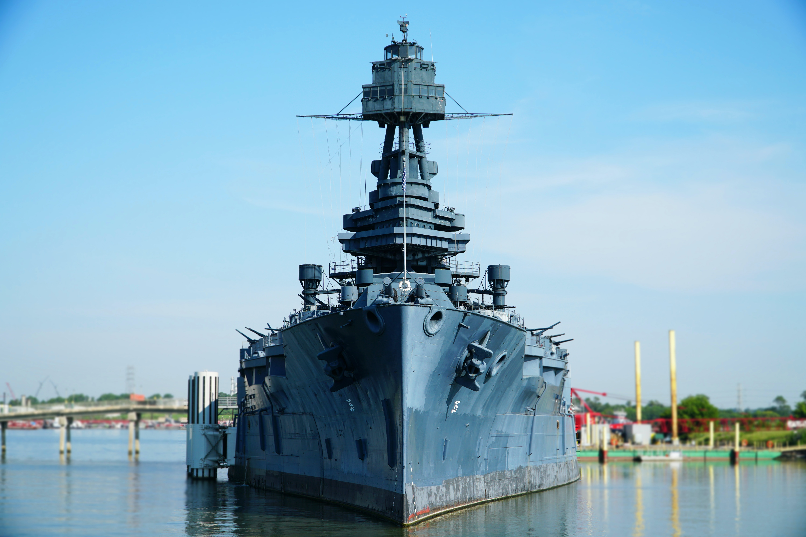

The past decade has been characterized by the rising influence of China in Asia-Pacific and the U.S. who continues to seek to be a major influence in the region. Both sides have tried to achieve this goal through deployments of their navies and this has resulted in increasing tensions. The U.S. asserts that Chinese naval actions have been eroding the rules-based order and has been conducting Freedom of Navigation Operations (FONOPs) in lieu of this. FONOPs are naval operations which “challenge maritime claims deemed excessive under international law” (Freund, 2017). FONOPs conducted in the South China Sea (SCS) started in 2015 and have been increasing in frequency (Panda 2020). The recent transition from the Trump administration to the Biden administration will see the continuation of FONOPs as part of the foreign policy for the U.S. (Petty, 2021). These operations are conducted to maintain the freedom of navigation as well as to protect the interests of the states with conflicting claims in the SCS.
However, are FONOPs actually used to maintain the freedom of the seas according to international law or are they merely a tool to deter China and maintain U.S. influence in the region? This article will analyze the intent of U.S. FONOPs and its effectiveness. Additionally, this article will look at the views of Southeast Asian states and their response and perception of U.S. FONOPs. Finally, policy recommendations will be made to increase the strategical success of U.S. FONOPs to strengthen the rules-based order in the region. Rules-based order is upheld through multilateralism and the current state of U.S. FONOPs does not reflect this. Thus, U.S. FONOPs should be used more sparingly and in a more multilateral function that promotes international law among the region rather than distinctively countering China.

## PURPOSE OF FONOPS
Before progressing, we should clarify there needs to be a clarification of the intended purpose of FONOPs. FONOPs are part of the larger U.S. Indo-Pacific strategy to maintain the rules-based order so that the U.S. can “preserve U.S. economic, diplomatic, and military access to the most populous region of the world and more than one-third of the global economy” (O’Brien 2021). The rules-based order is used with a wide definition encompassing the norms that the U.S. has built in the region based on liberal international order (Koda 2016). This means that the U.S. perceives Chinese actions as a threat to the rules-based order and the replacement of the U.S. as the hegemonic power that creates regional norms.
Central to U.S. influence in Asia-Pacific is the presence of the U.S. Navy. The FONOPs are conducted to reassure states, who see China’s increasing military capabilities as a threat, of their commitment to the region. However, there are several inconsistencies with this strategy. First, the rules-based order that the U.S. built was not built unilaterally but rather with the cooperation of regional states who found the U.S.-led order favorable and supported it (Heritage & Lee 2020). However, FONOPs have a unilateral element to it. FONOPs directly confront and deter China rather than cooperating with regional states to uphold the rules-based order (Valencia 2017).
The second problem is that the FONOPs are supposed to be a deterrent to Chinese territorial claims in the SCS. FONOPs directed against China are usually conducted around the Paracel or Spratly Islands with the aim of sending a message to China to stop their territorial claims. On the contrary, it is more likely to anger and elicit a retaliatory response. Chinese militarization of contested islands has not stopped and is being consistently developed (Wirth 2019). This is a cause for concern, as the increase in frequency of FONOPs decreases its deterrence effect and China could use the FONOPs as political leverage to legitimize their actions (Davis 2020).
However, this does not mean that FONOPs are ineffective because it still sends a statement towards China and Asia-Pacific that the U.S. and its navy is invested in the region. FONOPs have strategic significance to this end but lack the practical considerations that regional states face on a day-to-day basis. If the U.S.’s main goal is to maintain their relevance in the region and for the rules-based order to be the dominant norm, the U.S. needs to cooperate more with regional states rather than unilaterally conducting FONOPs.

## POLICY RECOMMENDATIONS
If the main goal of FONOPs is to ensure the rules-based order as the dominant norm, it needs to be supported by regional states. Norms cannot be unilaterally instituted. The dominant power creates the norms but it is the other states which ensure that the norms are followed (Heritage & Lee 2020). In the case of Asia-Pacific, the current norms are perpetrated by the U.S., but the growing influence of China may give rise to new norms if it is backed by regional states. This is why the perspective of regional states in Southeast Asia (SEA) are important to consider when analyzing the effectiveness of FONOPs.
There is no singular view of FONOPs by SEA states because different states have different leanings towards the U.S. or China. On one hand, states like Vietnam are more open to FONOPs which deter China (Grossman 2021). On the other hand, the overall attitude is that although SEA states welcome the U.S. military presence, they view FONOPs as increasing tensions with China which is detrimental for the region (Kausikan 2018). What is important for SEA states is that there is security, stability and non-militarization. SEA States regularly quotes UNCLOS to be upheld and what the states should abide by (Valencia 2020). They are all signatories of UNCLOS and have been pushing for a Code of Conduct based on international law for the South China Sea. FONOPs are not ideal as they disregard the agency of ASEAN states in maintaining international order.
The second point is that FONOPs do not address where the rules-based order is broken the most. While militarization of islands in the South China Sea are concerning, militarization is the aftereffects of the daily contest for influence in the waters near the islands. The way that China is able to build these military installations is because they have gained de facto control over the territorial waters through their daily operations. These operations are conducted through hybrid warfare by the Chinese Coast Guard and the maritime militia while the People’s Liberation Army Navy plays a minimal role in this (Patalano 2018). This cannot be countered by FONOPs, as confronting coast guard ships with naval ships would be considered as an overreaction (Patalano 2018). In this way, FONOPs do not concentrate on the problems that SEA states face.
Lastly, since SEA states value security and stability, they are most concerned with increasing tensions due to the FONOPs. China will react against every operation, causing the U.S. to conduct another FONOP and thus repeating the cycle. This is the typical security dilemma. While FONOPs may support the rules-based order, at the end of the day, the ones who have to deal with the consequences are SEA states. In lieu of this, what can be done to better integrate the interests of SEA states and to increase the effectiveness of U.S. operations in the region?

## POLICY RECOMMENDATIONS
First of all, the U.S. should continue FONOPs but it should not be a frequent operation. It should rather be in strategic response to high level actions by China which ignores the rules-based order. Apart from naval exercises and joint naval exercises, FONOPs are the most non-provocative action that can be conducted by the U.S. navy to send a strong signal of discontent against certain actions. These should be used sparingly to increase the significance of each FONOP (Davis 2020). It is important to have actions which are directed to different political and strategic levels.
In addition to this, the U.S. navy should work more with other states navies and coast guards to properly deter daily harassment by the CCG and militias. This could be done through joint training, patrols at the lower levels, and naval communication. This would build a stronger foundation for SEA states to have agency and directly counter Chinese action together with the U.S. However, this needs to be carefully implemented because it would be detrimental if this creates a U.S. bloc and China bloc which would further increase tensions and decrease regional stability. This initiative could be targeted towards Vietnam and Malaysia who have recently taken a stronger stance against China in the South China Sea (Grossman 2021, Moriyasu & Khan 2020).
The main priority and concern that the U.S. should have when trying to maintain the rules-based order in Asia-Pacific is to give proper agency to regional states to strengthen the norms in the region. Rules-based order is not something which can be unilaterally maintained and, through the cooperation of SEA states, the U.S. would be able to maintain its influence in the region.
Jeremy Lau is a graduate of the University of Tokyo's Graduate School of Public Policy at the University of Tokyo and has interests in the areas of defence policy and cybersecurity. He also holds a Bachelor's degree in International Relations from King's College London, where he studied the impact of Japan's National Security Strategy on foreign policy. He has also served as an officer in the Singapore Police Force.  

## REFERENCES
Davis, Daniel. (2020). “The Risk of Too Many Freedom of Navigation Operations.” The Diplomat. Accessed Nov. 23. https://thediplomat.com/2020/07/the-risk-of-too-many-freedom-of-navigation-operations/.
Freund, Eleanor. (2017). “Freedom of Navigation in the South China Sea: A Practical Guide.” Asia Maritime Transparency Initiative. Accessed Nov. 23. https://amti.csis.org/freedom-of-navigation-practical-guide/#:~:text=Freedom%20of%20Navigation%20Operations%20(FONOPs,deemed%20excessive%20under%20international%20law.
Grossman Derek. (2021). “What Does Vietnam Want from the US in the South China Sea?” The Diplomat. Accessed Jan 14. https://thediplomat.com/2021/01/what-does-vietnam-want-from-the-us-in-the-south-china-sea/.
Heritage, Anisa & Pak Lee. (2020). “The Sino-American confrontation in the South China Sea: insights from an international order perspective.” Cambridge Review of International Affairs 33, no. 1: 134-156.
Kausikan, Bilihari. (2018). “Strategic Outlook for ASEAN” ERIA. Accessed Jan 14. https://www.eria.org/uploads/media/News-and-Views/Mr-Bilahari-Kausikan_Keynote-Speech_ERT2018.pdf.
Koda, Yoji. (2016). “Maritime Security in the Region: SCS and ECS as Key Arenas for Converging Political Interests.” Asia-Pacific Review 23, no. 2: 86-108.
Moriyasu Ken & Wajahat Khan. “Malaysia says China's maritime claims have no legal basis.” Nikkei Asia. Accessed Jan 14. https://asia.nikkei.com/Politics/International-relations/South-China-Sea/Malaysia-says-China-s-maritime-claims-have-no-legal-basis.
O’Brien Robert C. (2021). “U.S. Strategic Framework for the Indo-Pacific”. National Security Council. Accessed Jan 14. https://www.whitehouse.gov/wp-content/uploads/2021/01/IPS-Final-Declass.pdf.
Panda, Ankit. (2020). “US Conducts Freedom of Navigation Operation Near China-Held Features in Spratlys.” The Diplomat. Accessed Nov. 23. https://thediplomat.com/2020/07/us-conducts-freedom-of-navigation-operation-near-china-held-features-in-spratlys/.
Patalano, Alessio. (2018) “When strategy is ‘hybrid’ and not ‘grey’: reviewing Chinese military and constabulary coercion at sea.” The Pacific Review 31, no. 6: 811-839.
Petty, Martin. (2021) “Explainer: South China Sea tension flares again as Biden takes charge.” Reuters. Accessed Jan. 25. https://www.reuters.com/article/us-southchinasea-usa-explainer/explainer-south-china-sea-tension-flares-again-as-biden-takes-charge-idUSKBN29U0LO.
Strangio, Sebastian. (2020) “What Would a Biden Administration Mean for Southeast Asia?” The Diplomat. Accessed Nov. 23. https://thediplomat.com/2020/11/what-would-a-biden-administration-mean-for-southeast-asia/.
Valencia, Mark. (2017). “US FONOPs in the South China Sea: Intent, Effectiveness, and Necessity.” The Diplomat. Accessed Nov. 23. https://thediplomat.com/2017/07/us-fonops-in-the-south-china-sea-intent-effectiveness-and-necessity/.
Valencia, Mark. (2020). “After ASEAN summit, little change on the South China Sea” Lowy Institute. Accessed Jan 14. https://www.lowyinstitute.org/the-interpreter/after-asean-summit-little-change-south-china-sea.
Wirth, Christian. (2019). “Whose ‘Freedom of Navigation’? Australia, China, the United States and the making of order in the ‘Indo-Pacific’”. The Pacific Review 32, no. 4: 475-504.