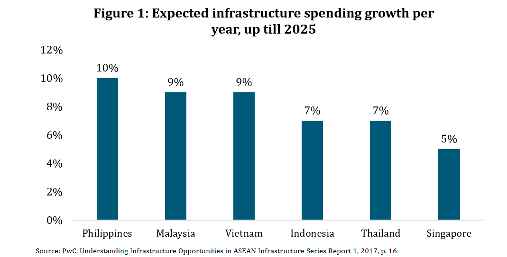
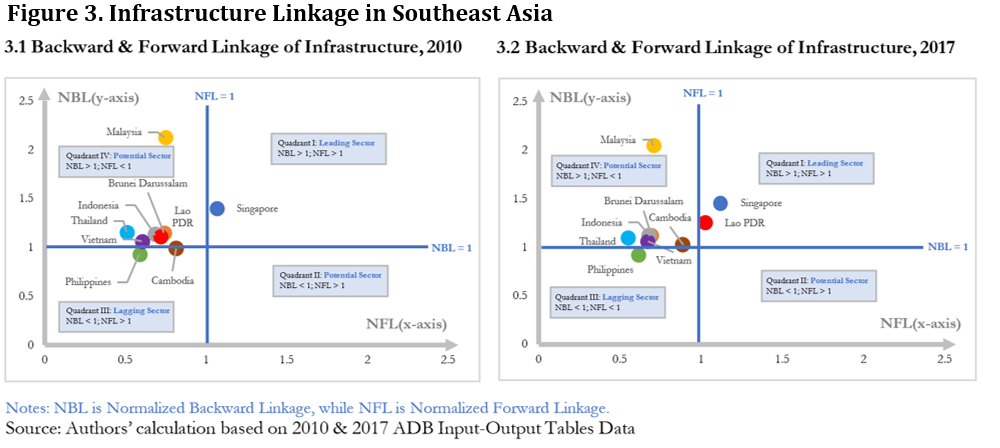
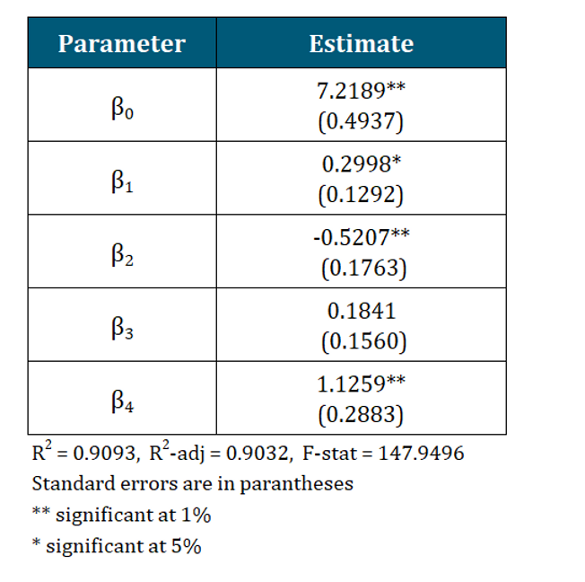

Since its establishment in 1967, the Association of Southeast Asian Nations (ASEAN) has undergone a major transformation into one of the world's fastest-growing economies. With an annual growth rate projected at more than 5.5% per annum, ASEAN is projected to become the world's fourth-largest economy by 2050 (ASEAN, 2017). Taking into account their ambition to become a global economic powerhouse, ASEAN mmber countries decided to pursue deeper economic integration by forming the ASEAN Economic Community (AEC) in 2015. The 2016 master plan document lays out a goal of realizing physically sustainable infrastructure by increasing investment in ASEAN member states. With the existence of adequate infrastructure that connects all countries in the region, it is expected to improve connectivity within the region, drive further economic growth, and facilitate trade and promote global competitiveness.

Developing proper infrastructure in ASEAN is not an easy matter as it requires enormous financing. The Asian Development Bank (2017) predicted that Southeast Asia should invest at least 5.7% of its GDP for incorporating climate adjustment to meet future infrastructure needs by 2030. ASEAN governments also have to strike a right balance between much-needed infrastructure projects and a country's funding capacity. Given the diverse levels of economic performance among ASEAN member states, their respective capacities to invest in infrastructure also differ. A report by PricewaterhouseCoopers (PwC, 2017) estimates the expected annual investment into infrastructure in ASEAN-6 countries until 2025.

The PwC report also pointed out that ASEAN countries tend to emphasize physical infrastructure, but other aspects of soft infrastructure such as health and education are less prioritized. This circumstance ultimately has a negative impact on economic growth in the region, as it limits access to jobs and prosperity and increases countries’ vulnerability to demographic changes. Against this background, this study intends to examine the interlinkages of the infrastructure sector with other sectors in the economy in the ASEAN region. The findings from this study will provide empirical evidence that shows whether the existence of infrastructure has been able to drive other economic sectors. In addition, the findings will also underline the importance of physical and non-physical infrastructure development for ASEAN.

## DATA DESCRIPTION AND METHODOLOGY

This study uses data retrieved from the latest published Input-Output Table (IOT) by ADB which has a matrix size of 35 x 35, corresponding to 35 sectors of the economy. We use an IOT analysis approach to determine the interlinkages between infrastructure and other economic sectors in each ASEAN member country. Myanmar is excluded due to data limitations. We also consider the construction sector as part of infrastructure. To measure whether infrastructure has strong linkages with other sectors in the economy, we calculate measures of backward and forward linkages. The backward linkage shows the interdependence of infrastructure on its supply sectors, such as the steel sector, cement sector, and others. Meanwhile, forward linkage exhibits the interconnection between infrastructure and its consumer sectors, such as the transportation sector, small and medium enterprises (SMEs), and so forth.

Following Temursho (2016) and ADB (2018), in normalized form, infrastructure is considered to have "high" normalized forward linkage (NFL) and "high" normalized backward linkage (NBL) if this sector has either NFL or NBL score which is greater than 1. In more detail, this infrastructure linkage analysis is classified into the following categories:

1. Leading sector, means that infrastructure has high forward and backward linkages (NFL > 1, NBL > 1). In terms of linkages, infrastructure is considered an "important" sector in the economy since this sector has high linkages with both suppliers and consumers in other sectors. In other words, infrastructure becomes a leading sector as it can boost both its downstream sector (transportation sector, SMEs, etc) and upstream sector (steel sector, cement sector, etc).
1. Forward-oriented sector, implies that infrastructure has a high forward linkage yet low backward linkage (NFL > 1, NBL< 1). This circumstance indicates that infrastructure is able to encourage the downstream sector but this sector is unable to boost its upstream sector.
1. Backward-oriented sector, shows that infrastructure has a low forward linkage but a high backward linkage (NFL < 1, NBL > 1). It means that infrastructure is able to encourage its upstream sector; however, this sector is unable to boost its downstream sector.
1. Lagging (weak) sector, signifies that infrastructure has low forward and backward linkages (NFL < 1, NBL < 1). In this case, infrastructure is not firmly connected to other industries, either with the suppliers or consumers. This also indicates that infrastructure is not a mainstay sector in a particular country.

We complement the IOT analysis with a panel data approach, using annual data from 2010 to 2017. This is based on the fact that panel data analysis allows researchers to generate relatively higher levels of statistical validity for policy analysis and program evaluation using research designs that are more sophisticated than statistical technique using cross-sectional data (Eom et al., 2007). Given the limited availability of data, Myanmar and Lao PDR are not included in the panel model. Consequently, the panel regression model contains 64 total observations. The panel regression model used in this study was adopted from Ismail and Mahyideen (2015), p.14, with some modifications, as follows:

The dependent variable used is economic growth proxied by real GDP per capita in constant terms (Y). This variable is retrieved from the International Monetary Fund’s World Economic Outlook Database. GFCF represents gross fixed capital formation relative to GDP, obtained from the World Bank database. This variable is expected to have a positive effect on growth. Considering that GFCF is one of the components of GDP, in this study, economic growth is measured through the lagged GFCF. Additional variables are also included such as technology readiness and human capital proxy, which are derived from The Global Competitiveness Report, published by World Economic Forum. Moreover, a control variable by including an interaction term with a dummy variable is also expected to influence economic growth. In this regard, STATUS represents the economic level of a country (as advanced economies, Singapore and Brunei Darussalam are recorded as 1, while the remaining ASEAN countries are recorded as 0).

## EMPIRICAL RESULTS AND ANALYSIS

In the past few years, ASEAN governments have made efforts to encourage infrastructure development. This can be seen from the contribution of infrastructure to GDP in each ASEAN country, which has increased over a period of seven years (see Figure 2). Cambodia and Lao PDR are the two countries in ASEAN that experienced the highest increase in infrastructure share compared to other ASEAN countries. Compared to 2010, the contribution of infrastructure in Cambodia and Lao PDR in 2017 to their GDP has increased by 7.0% and 3.1%, respectively. This achievement is inseparable from the efforts of the two countries in proclaiming ambitious infrastructure development towards the much-needed construction of airports, bridges, dams, roads, and ports. Other ASEAN countries such as Indonesia, Malaysia, the Philippines, and Thailand have also witnessed significant expansions in their infrastructure sector.

The linkages between the infrastructure and other economic sectors differ between ASEAN member nations. To illustrate, Singapore, as an advanced economy, has already had a high-quality infrastructure that makes this sector one of the leading sectors in the country, with both high backward (NBL > 1) and forward linkages (NFL > 1) since a decade ago. This condition indicates that the existence of infrastructure in this country is able to encourage its upstream sector (such as basic metals and fabricated metal, cement, etc), and at the same time boosts its downstream sector (such as the trade, transportation sector) which ultimately has a positive impact on the Singapore economy. Apart from Singapore, Lao PDR is the only developing country in the region that has succeeded in making infrastructure one of the important sectors in the country in a period of seven years. In 2010, infrastructure in Lao PDR was still unable to encourage its downstream sectors (NFL < 1), yet seven years later, infrastructure has been able to play a pivotal role as an intermediary input provider to its downstream sectors (NBL > 1 and NFL > 1), while concurrently improving socioeconomic conditions in the country. Examples include the completion of the hydropower project “Nam Ngiep 1” which makes Lao PDR an exporter of electricity to Thailand.

Infrastructure in other ASEAN developing countries, namely Malaysia, Brunei Darussalam, Indonesia, Cambodia, Thailand and Vietnam, have yet to reach the same level of backward and forward interlinkages with the rest of the economy. Based on our calculated backward and forward linkage scores, infrastructure in these six ASEAN countries has not yet become the leading sector since it is only able to boost the upstream sector (NBL > 1), yet unable to boost its downstream sector (NFL < 1). Infrastructure projects that have not been integrated with one another can be one of the reasons why not much infrastructure built is used as input for its downstream sector. As an illustration, the completion of airport construction is not accompanied by transportation facilities to and from the airport. We note that our data ends in 2017 and does not capture subsequent infrastructure developments that may improve these interlinkages. For example, in the case of Indonesia, the construction of the Trans Java toll road and mass rapid transit (MRT) Jakarta was completed in 2019 so that the impacts of those mega infrastructure projects are not captured in this analysis.

The infrastructure sector in Cambodia has been developing at a rapid pace. As set out in Figure 3.1, infrastructure in this country in 2010 was considered a lagging sector as this sector did not have strong linkages with other sectors (NBL < 1 and NFL < 1). Meanwhile, in 2017, as depicted in Figure 3.2, infrastructure in Cambodia is able to become a demand driver (NBL > 1) for other sectors in the economy, encouraging the development of upstream sectors such as metal, iron, steel, cement and other industries. However, as with other developing countries in the ASEAN region, there is still much room for Cambodia to provide a boost to its downstream sectors (such as SMEs, trade, transportation sector).

For the case of the Philippines, infrastructure is still considered a lagging sector (NBL < 1 and NFL < 1) in both 2010 and 2017. Infrastructure in the Philippines is not strongly connected to other industries, whether along its upstream or downstream sectors. Research from PwC (2017) shows that infrastructure investment per capita in the Philippines was the lowest coupled with inadequate infrastructure conditions compared to other ASEAN-6 countries. Moreover, Mendoza, et al. (2016) also found that political interference and public perceptions had caused infrastructure mega-projects in the country to become white elephants. These circumstances demand special attention from policymakers in the Philippines to deal with all aspects ranging from financing issues and political influence in order to realize the infrastructure sector’s potential to boost upstream and downstream economic activity.

After examining the interlinkages between infrastructure and other sectors in the economy, we proceed to explore the impact of infrastructure investment on economic growth. I employ a fixed-effect model on the panel data for this purpose. The results demonstrate that the lagged infrastructure investment (GFCF-1) has a positive and statistically significant effect on economic growth (GDP). Holding all else fixed, an increase in physical infrastructure investment in the previous year by 1% will increase economic growth by 0.30%.

My results also demonstrate that the additional effect of a 1% increase in infrastructure investment in the previous year, the average economic growth in developing countries in the ASEAN region is 0.59% higher than the economic growth in advanced economies. This finding indicates that developing countries still need to spur investment in infrastructure to further grow their economies, while advanced economies with adequate infrastructure will tend to reduce investment in infrastructure to seek other sources of economic growth. This corroborates findings from research conducted by PwC (2017), and Han et al. (2020) which underline that the rate of infrastructure investment to GDP in advanced economies tends to be lower than that of in developing countries.

The results from this analysis show that technological readiness (TECH) does not have a statistically significant effect on economic growth in the region. A possible explanation for this is that the majority of ASEAN countries do not yet have reliable technology during the study period to support the economy and promote global competitiveness. Additionally, it can also be seen that higher education and training (EDU) has a greater effect than physical infrastructure investment on economic growth in the region. Other factors held constant, a one percentage point increase in the higher education and training index increases the economic growth by 1.13%. This finding is in line with the 2014 World Economic Forum report which emphasizes the importance of high-quality education and training for countries to improve their domestic economies. To that end, ASEAN should nurture a pool of educated workers to ensure continuous improvement of workers’ skills to meet the changing needs of developing economies. These results encourage the importance of Southeast Asia not only improving physical infrastructure but also paying attention to human capital development for a strong and prosperous ASEAN community in 2050.

## CONCLUSION AND POLICY IMPLICATIONS

If ASEAN is to fulfil its potential as the fourth largest economic bloc and a key global market by 2050, ASEAN needs to continuously invest in quality infrastructure. Taking into account that infrastructure has not yet become the backbone of the economy, developing countries such as Indonesia, Malaysia, Thailand, Vietnam, and Cambodia, should pay more attention to encourage infrastructure to have a strong linkage with its downstream sector.

One of the efforts that should be made by policymakers is to ensure that infrastructure development is completed according to the predetermined targets and infrastructure built should be integrated with one another. Increasing investment in infrastructure also needs to be carried out given that developing countries in the ASEAN region still have to boost their economies.

In addition, considering that financing is still a challenge for the majority of ASEAN countries, policymakers in the region should also ensure that the construction of large-scale infrastructure projects provide a positive impact on the domestic economy and not undertake them on political motivations to avoid white elephants. Last, but definitely not least, ASEAN countries should also invest in their human capital by improving skills and education, with the ultimate aim of enabling long-term growth and development to benefit the region.

---
