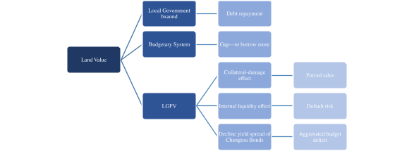
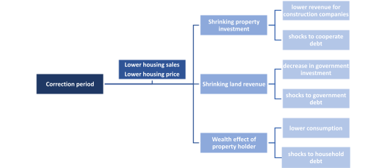
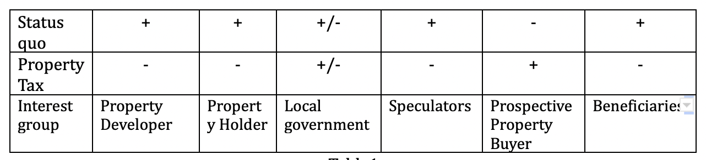

## INTRODUCTION

Fluctuations in China's housing market would inevitably induce both direct and indirect shocks to the ever-expanding local government debt. 
To ensure the sustainability of the local government budgetary system and reduce the related fiscal risks, it is essential for local governments to find alternative sources of financing and break away from excessive reliance on the land. 
At the same time, a robust local government balance sheet is vital when encountering structural changes in the industry during the correction period. Two existing policy instruments: levying property tax and issuing local government bonds, have been evaluated. 
And the suggested policy options are: 

1. Establishing a sound local government bond market with a differentiated rating scheme, better trading infrastructure and a more sophisticated monitoring system; 
2. Conducting fiscal reform: centralization of pension funds and unemployment system; and 
3. Minimizing the adverse effects through fiscal adjustments in the short run.

## BACKGROUND

The intertwining relationship between the housing market and the government budgetary system could induce substantial risks to the local government' debt which has already reached the level of around RMB51 trillion. 
Together with the prosperity of the property market in China, land has played an indispensable role in the Chinese local government's balance sheet. 
Income generated from land leasing activities accounted for 29% of local government revenue. 
At the same time, land owned by the governments constitutes a principal source for LGFV (local government financing vehicle) to issue Chengtou bonds and borrow from banks. 

China has the highest local government debt as a percentage of the public debt of 59% at end-2013 according to the OECD. 
This is quite striking for China as a unitary system. By 2020, the amount of officially explicit debt written on the balance sheet stood at the level of RMB 26 trillion. 
As for the implicit debt, the actual size is often hard to gauge as local governments usually take circuitous approaches to finance their expenditures. 
If we only take account of the size of Chengtou bonds (issued by Local Government Financing Vehicle) as its off-budget quasi-fiscal support, the amount of implicit debt is around RMB 25.5 trillion. 
The LGD situation also varies across provinces; for those well-developed regions such as Beijing or Shanghai, the LGD to GDP ratio is around 22%. 
The LGD represented more than 80% of GDP for less developed areas. 
The LGD to budget revenue in Qinghai even surges to nearly 962% in 2020. 
Thus, it is not surprising that along with the possible burst of the housing bubble, the ever-accumulating local government debt (LGD) is regarded as the grey rhino to the Chinese economy. 
Its complex and opaque structure could induce significant risks to the financial system and the sustainability of the Chinese economy.

As the golden era for the property market is reaching its end, the local government needs to reconstruct a healthier balance sheet with less reliance on land finance. 
A potential slowdown in the property market is forecasted and would aggravate the financial problems of the local government. 
The incident of the Evergrande crisis has further pushed Beijing to curb speculation in the real estate market and constrain banks' lending to property developers. 
The three red lines measures which include putting caps on debt to cash, debt to asset and debt to equity ratios have been introduced for constraining the debt level of those real estate companies at a reasonable level. 
Such a process of ruling out supportive measures in the property market in China is regarded as the correction period.  
Less reliance on land finance is essential to ensure the sustainability of government debt and prepare for the potential economic pain during such periods.

## THE ROLE OF LAND

The highly decentralized fiscal system has resulted in the high reliance of local government on land-related revenues and its intertwining relationship with the property market. 
The 1994 tax revenue centralization has left the local government with a huge budget gap. 
They are responsible for more than 85% of public services and urbanization development expenditures, whilst it only owns 53% of the budgetary revenue. 
Since local governments could not borrow money directly from either the markets or banks before 2014, two unique funding instruments have been formed and generalized: "land urbanization" and LGFV (local government financing vehicles). 
Within these two funding instruments, land plays an indispensable role. 

Land leasing revenues constitute a significant source of government revenues. 
Before the reform of The Land Administrative law in 2019, the local government had the monopoly power of transforming rural land for urban development. 
Land use rights are transformed through the "Zhaopaigua" mechanism in which bidders with the highest bid would obtain the right of developing land. 
Moreover, those land leasing activities are often involved with the promise by local governments on improving local infrastructure and business environment. 
Thus, naturally, land prices are substantially higher than the market justified. 
With the boom of urbanization and the proliferation of the property market, this large-scale land value capture resulted in the increased reliance of local government revenue on land sales proceeds. 
Land leasing revenue accounted for more than 80% of the government fund revenues. 
These revenues have been used to balance their fiscal budgets and pay back the interest of government bonds. 

In the LGFV system, land and its related future revenue streams act as high-quality collateral to leverage for borrowing. 
To establish the LGFV platforms, local governments provide capital through budget revenue injection, land use rights, or existing assets transfer. 
Once they meet the capital requirement, LGFVs could then finance the rest through bank lending or raising funding from equity or bond markets. 
At the same time, the proliferation of the property market featured by high housing prices substantially increased the expectation of lending entities on the value of the land collateral. 
They are willing to lend to LGFVs regardless of the actual financial returns of their projects or businesses. 
According to the audit conducted by China's NAO in 2013, among those outstanding local government debts, 37% used future land sale revenue as collateral. (Liu, Xiong 2018). 

Though the inflated land value and the land-backed LGFV system has released local governments from the imbalanced budgetary system, the land-based budgetary system further magnified the expanding local government debt risks. 
This intertwining relationship between land and government financing systems has increasingly made local governments vulnerable to potential shocks within the real estate market. 


## PROBLEM ANALYSIS

The Chinese property market has been declining since the central government introduced a series of “correction”measures. 
Following years of stop-start attempts of the Chinese central government to tame ever-increasing housing prices, aggressive measures have been adopted recently to combat the irrational exuberance within the property market. 
Since 2020, the government has imposed the "three red lines" principles to further constrain the borrowings of property developers by setting caps on the amount of debt in proportion to the value of their assets, cash holdings and equities. 
Along with the credit squeeze of state-owned banks, private equity funds are also banned from raising money to invest in residential properties. 
The credit curbs have even pushed the world most indebted property developer, Evergrande, to the brink of default. 
According to the newest statistics, the percentage of bought-in in the recent land transaction markets has reached the level of 30%, which signifies the dwindling property investments. 
In the long run, the reached capacity of urbanization and ageing population would also add to the declining trend of property demands from the public. 
The recently released data states that the number of first-time homebuyers in the age group of 25~39 is expected to decline by 25% in the next 20 years, from 327 million to 247 million. 
Though it is hard to tell now whether the housing bubble would pop, with the tightening regulatory noose, a slowdown in the housing market would be foreseen, accompanied by a declining land value. 
It is recognized that stringent measures of deleveraging real estate developers could indeed, to some extent, break down the vicious circle of property speculation and credit boom. 
Concurrently, it would also threaten the land values, which are essential to the financial health of local government. 

The "corrections" within the property market directly contaminate the sustainability of local government debt through two channels: compromising the local government's ability to repay debt and eroding the collateral values of LGFVs.



Cautious banks would require more collateral for further deleveraging; this could force the LGFVs to sell the current land to meet the increased capital requirements from the bank. 
Moreover, under the context of reduced borrowing, LGFVs have to rely more on internally generated cash. 
Nevertheless, many of their projects are on real estate or infrastructure developments; they have spare internal cash and limited profits. 
The vicious circle would induce potential default risks of LGFVs on the outstanding debt. 
Though LGFV loans are excluded from the local government balance sheet, investors would naturally expect some form of bailout from local governments and, ultimately, the central government. 
The implicit guarantee would add substantial risks to the health of local government debt. 

Investors price local housing risk into the risk premium of Chengtou bonds issued by LGFV. 
By investigating the linkage between the solvency of LGFV debt and local housing market risk, Ambrose, Deng, and Wu (2016) state that a decline in yield spreads is observed for bonds issued by local investment units from areas experiencing more significant changes in housing prices. 
It is expected that the correction period of the housing market would influence investors' confidence in the Chengtou bonds market, which have been the major financing source for local government infrastructure projects. 

The indirect shocks refer to the economic pain involved during the property market correction period. 
The following chart illustrates the base scenario of how the correction period would influence different stakeholders within the property market. 



The lower housing sales and decreasing trend of housing prices would lead to:

1. Lower incentives of property developers and local government on further investments,
2. Decreasing revenues of construction companies,
3. Negative wealth effect on property holders.

These indirect shocks could collectively induce a decline in economic growth and risks to sovereign debt sustainability, including corporate debt, LGD and household debt. 
The credit market contagion might increase the cost of borrowing within the market. 
Moreover, when facing an economic downturn, the local government might need to take on the stimulus package introduced by the central government, which would exasperate its already imbalanced budgetary system. 
Assuming the worst scenario, if the property market fails to achieve the "soft landing" or the bubble burst, the economy will likely enter a recession. 
The 2008 housing crashes in the USA have resulted in a record-high budget shortfall of the state, accompanied by a reduction in consumption and income tax revenue as well as a surge in government spending. 

## POLICY EVALUATION

China has contemplated two policy approaches that aim to break away from the land-oriented budgetary system and ensure the sustainability of local government debt. 
The first one involves the local finance reform of levying property tax; the second  is to construct a municipal bond market to promote further asset securitization. 

Levying property Tax could reduce the fiscal pressure of local governments to a certain degree by providing alternative sources of financing. 
At present, there are five kinds of taxes related to the property market: urban and township land use tax, arable land occupancy tax, land appreciation tax, real estate tax, and deed tax. 
But various taxes on land only account for 16% of local tax revenue, which is inadequate and unstable to cover the local government fiscal gap generated by the misalignment of revenue and expenses. 
The introduction of property tax could provide local governments with a more stable source of financing to reduce the heavy reliance on the land. 
At the same time, the imposition of property tax also stays aligned with the central government's strategy in cooling down the property market by increasing the cost of holding unused properties. 
Several pilot programs have been implemented in Shanghai and Chongqing, which allowed the municipal governments to collect property taxes on newly purchased second homes or high-end residential properties. 

Various stakeholders would act differently in corresponding to the changes in the taxation scheme. 



As a result of levying a property tax, real-estate investors (speculators) might adjust their portfolios away from the residential property investment. 
The potential decrease in demands would push down the housing price. 
Property developers, current property holders, are negatively affected by the devaluation of the assets attributed to the wealth effect. 
Moreover, there would also be knock-on effects in steel, cement, and other industries closely tied to construction. 
As for the local government itself, the adoption of property tax will lower the demand for land, thereby substantially reducing the amount of land leasing fees obtained from land leasehold. 
There exists a trade-off evaluation on the imposition of property tax. 
Strong opponents would also arise from the public, especially those who already hold more than one property; the general unfamiliarity would lead to continuous misinterpretation and misunderstanding on levying property tax. 

Further improvements are required as questions remained on whether the incremental tax revenue would be sufficient to cover the fiscal gap and the contagion effects of this exogenous shock on the economy. 
A good taxing scheme is designed by ensuring the fairness of taxpayers and the benefits of receivers; thus, tremendous efforts are required to minimize the distortion towards the economy. 
Most importantly, the determination from the government side is also essential for the successful establishment of the property tax scheme. 

The issuance of local government bonds could reduce the fiscal risks generated from the "hidden debt" by opening the front door. 
Only since late 2014, to hamper significant fiscal risks generated from the off-budget financing, provincial governments were allowed to issue government bonds with specific annual cap instructed by the central government. 
The authorities have been encouraging local governments to issue "special bonds" that finance infrastructure investments through increasing the quota to nearly RMB 4 trillion in the year 2021; the small increase is witnessed in the quota for "general bonds" that finance general government spending. 
Government bond issuance is becoming one of the most important financial instruments for local governments to shoulder the necessary cross-cyclical adjustments. 

However, the Chinese local government bond market is still underdeveloped. Four impediments include: narrow investor base, low liquidity, mismatched rating and yield, and a focus on quantity rather than quality. 

1. Limited institutional investors are integrated into the development of the local government bond market. 
    Mutual funds, pension funds and insurance companies traditionally regarded as the primary investors for long term government bonds are not actively involved in the scheme. 
    Commercial banks hold nearly 80% of the issued bonds. Before 2018, the issuance of government bonds was targeted to the bond swap program. Banks are the major provider of loans to LGFV; consequently, they become the primary purchaser of bonds issued in exchange for LGFV debt. 
    Since the exchange bonds' coupon rate is low, banks could suffer from mark-market loss if the bonds are sold. 


2. Compared to sovereign bonds or other public issued bonds, the total annual turnover ratio was meagre for local government bonds. 
    The average turnover ratio was only 4% of the outstanding amount in 2017, according to Lam, Wang (2018). 
    The low liquidity of the bond markets will discourage investors from investing as it is hard to resell the bonds. 


3. The rating scheme of local government bond are homogenous.
    Significant differences in terms of development are observed across provinces; however, the rating does not reflect such differentiation. 
    The bonds issued by diverse provinces are not rated regarding their growth prospective, fiscal fundamentals and debt ratio. 
    In addition, the lack of differentiating rating would impede the facilitation of yield differential.
    This is particularly detrimental for the bond market development as investors are prone to seek different risk-return combinations. 


4. Raised funds might not be appropriately delivered and effectively used, even though the size of "special bonds" is expanding, "special bonds" accounted for a large proportion of bond issuance; the amount has surged from RMB 100 billion to RMB 4 trillion in 2020. 
    By 2020, about 3% of the funds raised by bond issuance were not distributed into the right use, and many of them are infrastructure investments. 
    At the same time, the central government would set up issuance goals for each province. 
    To meet the issuance target, funds are allocated to those risky projects. 
    Since the repayment of special bonds is based on the cash flow generated from each project, there are potential default risks for those unprofitable projects.


## POLICY RECOMMENDATIONS

Establishing a sound local government bond market. 
It is recognized that permitting the local government to issue bonds could significantly reduce the fiscal pressure of the budgetary system. 
In comparison to LGFVs, opening the front door with a more regulated and transparent scheme would reduce the exposure of the local government to systemic risks. 
Thus, a sound government bond market would be essential for the sustainability of local government debt with lower reliance on the land. 
The recommended policies are: (1) Facilitating rating differentiating; (2) Enhancing liquidity and investor base; (3) Improving the regulation scheme. 

1. A differentiated rating scheme should be introduced, the rating level of government bonds issued by different local governments should be critically and transparently evaluated through third-party rating agencies. 
    The rating should depend upon demographic features, economic strength, budgetary strength, debt burden, liquidity, governance, etc. 
    Moreover, part of the undifferentiated rating is due to the belief of investors that the central government would be the "lender of last resort". 
    The central government could introduce a no-bailout clause through legislation to mitigate the related moral hazard problems. 

2. Improving trading infrastructure arrangements is critical for maintaining the functioning of local government bond markets. 
    It includes allowing the mark-to-market evaluation by providing real-time trading data; additional issuance or renewal of special bonds for the same project could be introduced to increase the liquidity of the market. 
    The central government could also lift the arbitrage limits on bidding to encourage more trading within the market. 

3. A sophisticated monitoring system should be introduced to ensure the fundraising of each project through the local government bond market is appropriately utilized.  
    The respective roles and responsibilities of various stakeholders in the legislation should be further clarified to enhance fiscal coordination and promote transparency in local government bond issuance. 
    At the same time, there should also be a clear and explicit legal mandate of the central government, along with an enforcement regime to address noncompliance or violation issues. 

Conducting fiscal reform: centralization of the pension funds and unemployment system. 
The fundamental reason for the imbalanced budgetary system and the ever-accumulating debt is the misalignment of expenditure and revenue since the 1994 tax reform. 
In China, the pension fund and employment insurance program are consolidated on the provincial level, and it has created an enormous burden to the financial health of the local government. 
A centralization of expenditure of pension funds and employment insurance programs is recommended. 
On the one hand, it will lower the spending pressure of the local government and reduce the need for high reliance on "land urbanization" and off-budget borrowing. 
On the other hand, it could also reduce the cost of risk pooling and ensure equal access to individuals regardless of their area. 

Minimizing the negative effects in the short run. 
Building an adequate and robust financing instrument is recognized as the basic condition for the sustainability of the local government debt; in addition, the centralization of expenditures through re-building local-central government relationships is also essential. 
Nevertheless, there exists a time lag between the implementations of these policies and their actual effectiveness. 
In attempting to minimize the negative shocks of the "correction period" on the local government's financial health, the central government plays an important role in the short run. 
If it is necessary, to avoid the potential defaults, the central government could increase the direct transfers to the local government. 
Though this instrument is not sustainable in the long run as it might return to the old path of "lender of last resort"; in the short run, it could provide the essential room for adjustments. 
Furthermore, it is recommended that fiscal funds supplement bank capital or reduce bank reserve ratios to reduce financial intermediaries' deposit and loan premiums. 
In this way, we can avoid a local government default and reduce the cost of financing in the whole economy, ultimately minimizing the negative economic impact of the "correction period".


```text
Yijin is in the second year of her Master's degree in public policy at The University of Tokyo. She is interested in issues of sovereign debt, monetary policy, and central banking. Before entering graduate school, She completed an undergraduate degree in Economics at the London School of Economics.
```

## REFERENCES

1. Ambrose, Brent & Deng, Yongheng & Wu, Jing. (2015). Understanding the Risk of China's Local Government Debts and its Linkage with Property Markets. SSRN Electronic Journal. 10.2139/ssrn.2557031.
2. Ang, Andrew, Jennie Bai, and Hao Zhou. 2016. The Great Wall of Debt: Real Estate, Political Risk, and Chinese Local Government Credit Spreads. 
3. Azuma,Y. and Kurihara.J(2011) Examining China’s Local Government Fiscal Dynamics: With a Special Emphasis on Local Investment Companies(LICs), Politico-Economic Commentaries, no.5, pp. 121-40.
4. Bruce,Jurgen, 2016. Knowledge Work Knowledge Work on Local Government Bond Market in the People's Republic of China. ADB. 
5. Chen,He,Liu, 2018. The Financing of Local Government in the People’s Republic of China: Stimulus Loan Wanes and Shadow Banking Waxes, ADBI Working Paper. 
6. Feng, Xingyuan. (2013). Local Government Debt and Municipal Bonds in China: Problems and a Framework of Rules. Copenhagen Journal of Asian Studies. 31. 23-53. 10.22439/cjas.v31i2.4332.
7. Gao,Gong, 2017. Land Finance, Housing Demand Shock and Economic Fluctuations. No4.2017 General No. 442, Finance Research(In Chinese) 
8. Huang, Bosler, 2014. China’s Debt Dilemma-Deleveraging While Generating Growth. Carnegie Endowment for International Peace. 
9. Lam,Wang, 2018.China’s Local Government Bond Market. Working Paper,IMF. 
10. Liu, Xiong,2018. China’s Real Estate Market. Chapter for “The handbook of China’s Financial System”. 
11. Liu,2018. Land Financing-led Urabnization in China: Evolution, Scale and Lessons, UNECA. 
12. Naito, 2020. The Financial Situation in China: Issues and Challenges. Vol16,No3, Public Policy Review. 
13. Natacha Aveline-Dubach. China’s Housing Booms: A Challenge to Bubble Theory. Théories et modèles d’urbanisation, pp.183-208, 2020, 10.1007/978-3-030-36656-8_11 . halshs-02963810 
14. Ouyang, A.Y. & Li, R. (2021) Fiscal decentralization and the default risk of Chinese local government debts. Contemporary Economic Policy, 39:641–667. https://doi.org/10.1111/coep.12531 
15. Subnational Governments Around The World—Structure and Finance, 2016, OECD.
16. Subnational Governments in OECD Countries: Key data (2021)
17. Wingender, 2018. Intergovernmental Fiscal Reform in China. Working Paper,IMF. 


