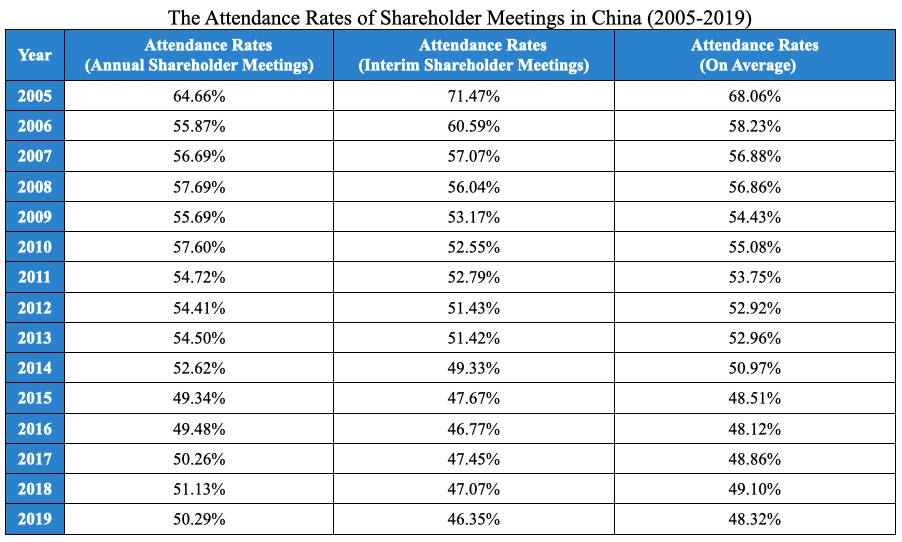
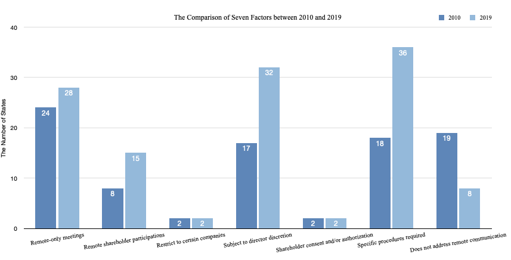

## BENEFITS AND RISKS OF ONLINE SHAREHOLDER MEETINGS

Online shareholder meetings (OSM) are shareholder meetings held fully online. Various factors like dispersed shares, unforeseen emergencies (including the current pandemic), rising agency costs, and maturity of online meeting platform, have facilitated the adoption of OSM. 
OSMs can be beneficial to companies that hold them. Firstly, OSMs are cheaper to hold for companies, as seen by the example of Inforte whose online annual meeting cost 10% of a physical in-site meeting (Beske 2002, pp.8-17). OSMs also provide more flexibility for shareholders and may facilitate higher attendance rates. Furthermore, adopting OSMs can act as a public signal that companies are being ahead of technology trends. This may be the reason why companies in the information and technology sector are major adopters of OSMs (Buellingen 2019). Many of these benefits have become more prominent in light of COVID 19, where OSMs have allowed shareholders to exercise their rights despite restrictions on physical meetings. 
However, OSMs may also have their drawbacks. Despite lowering the costs of attendance, virtual meetings may reduce the opportunities for interaction between shareholders. Furthermore, OSMs provide more avenues for directors to isolate and suppress potential shareholder dissent (Mclean 2013, p.208). These risks highlight that safeguards should be provided to guarantee investors’ rights before applying the OSM. 

## LACK OF PROVISION FOR ONLINE SHAREHOLDER MEETINGS IN CHINA

In China, listed companies are not allowed to hold OSMs, as the rules for shareholder meetings state that the “general meeting of shareholders shall be held in the form of on-site meeting”. Online voting is distinct from OSMs and is just a supplement to traditional meetings. With online voting, only some shareholders can vote online, and they cannot exercise other rights such as questioning via the internet platform. Companies have increasingly adopted online voting in recent years, with the proportion increasing from 59% in 2014 to 97% in 2019.

Source: China Stock Market and Accounting Research Database

How have “on-site meetings with online voting” impacted shareholder attendance? Shareholder meetings attendance rates in China have experienced a substantial decline in the last 15 years, caused by increased dispersion of shares and the reduced willingness of individual shareholders to attend. However, this decline was substantially moderated in 2015-2019, which coincides with a rapid increase in the adoption of online voting. This suggests that online voting may have positive effects in allowing for smaller shareholders to participate in shareholder meetings, slowing down the decline in attendance rates.  

Source: China Stock Market and Accounting Research Database

Despite its widespread adoption, some parties still oppose OSM on the grounds that managers may take measures against investor interests. While these do not warrant outlawing OSMs, safeguards should be instituted to protect shareholders. But what form should these safeguards take? The experience of the United States (USA) may yield useful lessons.

## AMERICA'S LAWS GOVERNING ONLINE SHAREHOLDER MEETINGS
In 2000, the Delaware General Corporation Law (DGCL) was amended to accept OSM, and the amendments can be summarized as “one sole discretion and three specific procedures”. The “sole discretion” enables the board of directors to hold the OSM without shareholders’ consent. Namely, if the bylaw does not specify the place of meeting, and the board of directors is authorized to decide the place, then the OSM can be held regardless of shareholders’ opposition. Therefore, shareholders can only decide the place in advance to exclude the sole discretion rule. During the online meeting, three procedures need to be followed: First, the corporation should verify shareholders or proxyholders’ identities. Second, the corporation should create the opportunity for shareholders or proxyholders to participate, to vote, and to read or hear the proceedings of the meeting. Third, shareholders and proxyholders’ actions should be recorded by the corporation.
Due to the DGCL’s influence as something akin to a national law of corporations (Ragazzo 1999, p.1099), other U.S. states have taken different attitudes towards OSMs, ranging from complete adoption of the DGCL provisions to outright rejection. 

Considerations in US law regarding OSMs in the U.S. can be categorized into seven factors: 

1. Remote-only meetings; 
1. Remote shareholder participation; 
1. Restrict to certain companies; 
1. Subject to director discretion; 
1. Shareholder consent and/or authorization; 
1. Specific procedures required; 
1. Does not address remote communication.

The figure below shows the proportion of US states that adopt the seven factors as of 31 December 2019. A comparison with 2010 is also provided in the next figure. 

Firstly, although it has been 20 years since Delaware accepted the OSM, only a small majority of states (55% of the total) have followed suit in allowing for OSMs. However, 84% of the states acknowledge remote shareholder participation, which indicates the increasing importance of online participation in shareholder meetings. Secondly, among the states that allow the OSM, 74% of them adopt the “sole discretion rule” and authorize the board the power to hold the OSM without consulting with shareholders. Lastly, most states (84%) that accept the OSM have specific procedural requirements to safeguard against infringements of shareholder rights. Indeed, between 2010 and 2019, laws and regulations on OSM have become more sophisticated and consider a wider range of factors, as illustrated in the figure above. 

## WHAT CAN WE LEARN? BALANCING FLEXIBILITY WITH SHAREHOLDER PROTECTIONS

Based on our discussion of the Chinese and USA experiences with OSMs, what are the lessons that other countries can learn? I suggest three lessons for countries contemplating to adopt OSM in their respective regimes. 
Firstly, policymakers should provide some degree of choice to companies and shareholders to hold OSMs. Outright bans on OSM deprive both companies and the government of valuable learning opportunities to assess the costs and benefits of OSMs. As discussed, companies in China and the USA have indeed shown interest in online forms of shareholder participation, whether via online voting or OSMs (Buellingen 2019). Instead of being overly restrictive, the law should provide companies the opportunity to take advantage of technology by providing sufficient options for OSMs to be held. 
Notwithstanding the above, OSM rules should be designed considering the context of local legal practices and traditions. For example, the US model’s emphasis on the board discretion is unlikely to be acceptable in China, which places more emphasis on the centralism of shareholders in Chinese listed companies (Zhang 2019, pp.130-131). Hence, countries with laws similar to China should consider providing more say to shareholders in holding OSMs. For instance, their laws and regulations should require explicit shareholder consent to hold an OSM, to prevent managers from using OSMs unilaterally as a tool to suppress shareholder dissent. 
Third, sufficient safeguards on procedural requirements should be instituted to protect shareholders’ rights. The meeting procedures prescribed by US laws may be too broad to provide the specific protections required for shareholder rights. Policymakers should enacted detailed regulations that offer certainty to both companies and shareholders. The development of such regulation would be a collaborative process between the executive, legislative, and judicial branches. For example, company law can provide that the OSM procedures should at least comply with the regulations enacted by the government and relevant regulators. When shareholders bring suits to courts, judges should rule on whether the OSM’s procedural requirements have been violated based on detailed requirements in regulations or even company law principles. These judicial opinions should, in turn, be reflected in future laws, regulations, and policies. This process will be conducive towards ensuring that policies and regulations can develop considering the real-life experiences of shareholders and companies. 

## CONCLUSION: ENSURING CORPORATE LAW IS RELEVANT IN THE DIGITAL AGE 
“Too tight to thrive” is not an exaggeration - the legal framework in some countries, including China, are too restrictive towards OSMs. Countries should consider relieving restrictions to offer a “place” (literally and abstractly) for online meetings while safeguarding shareholder interests. As Kanda (2013, p.213) says, “The amendment of company law should be in line with improving competitiveness, embracing IT revolution, and expanding capital market.” As the practices of companies evolve, so too should the laws that govern them. Appropriate governance of OSMs will be a key test of whether laws and regulations can keep up with technological developments in this age of digitization. 
Rongjie Fang is a master’s candidate at the Graduate School of Public Policy, the University of Tokyo. He earned an LL.B. at Shenzhen University. His main interest is in corporate governance, financial regulation, and law and public policy. He thanks Professor Chenglong Lu and the Editors for their helpful inspiration and feedback on this article.

## References
Beske, G.A., (2002). Shareholder Meetings Online. In: J.F. Olson & C.J. Lawrence, ed. Securities In The Electronic Age: A Practical Guide To The Law And Regulation. 3rd ed. New Jersey: Glasser LegalWorks.
Buellingen, M.C., (2019). Virtual Shareholder Meetings in the U.S. [Online]. Harv-ard Law School Forum on Corporate Governance. [Viewed 10 November 2020]. Available from:https://corpgov.law.harvard.edu/2019/10/10/virtual-shareholder-meetings-in-the-u-s/
Fiarfax, L.M., (2010). Virtual Shareholder Meetings Reconsidered. Seton Hall Law Review. (Vol.40), pp.1367-1432.
Kanda, H., (2013). The Philosophy of Company Law. Beijing: Law Press China.
Mclean, J., (2013). Sole Discretion Is Too Much Discretion: An Analysis of Delaware’s Online Shareholder Meeting Statutory Model. Kansas Journal of Law & Public Policy. (Vol.23), pp. 203-220.
Ragazzo, R.A., (1999). Toward a Delaware Common Law of Closely Held Corporations. Washington University Law Quarterly. (Vol.77), pp. 1099-1151.
Zhang, W., (2019). Law of Capital II. Beijing: China Legal Publishing House.