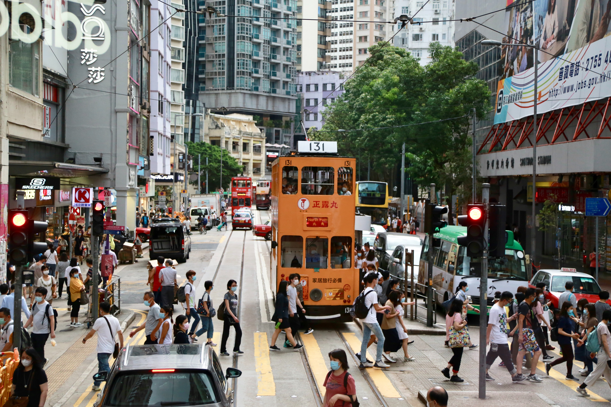

What does the term ‘nation’ mean to Hongkongers? Many Hongkongers are asking themselves, ‘Who am I?’ and seeking to define the elements that contribute to the self-identification of a ‘Hongkonger.’ 
In recent years, contentious politics have been a central part of Hongkongers’ livelihoods, to protect the value system Hongkongers have long treasured in their society—freedom and democracy—from Chinese encroachment. Yet politics has not settled down since the implementation of the National Security Law (NSL) in Hong Kong. On an unprecedented scale, the authorities are enacting measures to dissipate the momentum of the pro-democracy movement in the name of national security. The draconian law inevitably shattered the mobilisation of the pro-democracy movement. From a cultural perspective, what are the implications of having a national identity distinct from a Chinese identity after the implementation of the National Security Law? 
In Hong Kong, the discourse on national identity has been carefully crafted by the Chinese state. Since the Handover, China has always wanted Hongkongers to shed their pride in their British colonial roots and instead adopt a sense of Chinese identity (Lo 2007). To cultivate a sense of Chinese identity among the population in Hong Kong, Chinese cultural promotion programmes were deployed. 
Up until 2008, at around the time of the Beijing Olympics, the use of public diplomacy gradually improved the image of the Chinese state in the hearts and minds of Hongkongers, with people’s identification as Chinese reaching new heights (Fung & Chan 2017). However, instead of celebrating the phenomenon, the Beijing authorities read the message from another angle and believed that Hongkongers were not patriotic enough. More objective-oriented socioeconomic and education programmes were deployed to enhance the sense of Chinese identity among the Hong Kong population. 
In 2012, the Education Bureau suggested the introduction of the Moral and National Education programme to better inform students about the responsibilities of being a Chinese citizen and the recent developments of China. However, the suggested teaching material was biased towards the Chinese state narrative of national development, in that the text glorified Chinese economic development and downplayed accusations of the abuse of civil and political rights in mainland China (CBC 2012). As a result, the programme fired up huge public controversies over the design of the curriculum. The bias of the material suggested that in Beijing’s eyes, education is an instrument for promoting uncritical patriotism in Hong Kong (Vickers 2003).
Beijing also believed that increased flows of people between Hong Kong and China would enhance interdependency in socioeconomic activities and thus assimilate Hong Kong into the Chinese grand development plan. Instead, increased flows of people from China pressured local livelihoods which eventually brewed anti-China sentiments in Hong Kong (Fong 2017). Ultimately, a mixture of anti-Chinese sentiments and the fear of the erosion of democracy and political freedom led to outbursts of social movements against Chinese interference in Hong Kong’s affairs. 
Consequently, there have been continuously heated tensions between Hong Kong and the Mainland over the past ten years, which drove antagonism towards any political symbols related to China. Take the national anthem, for example. Since 2004, local television broadcasts have been required to air a government-prepared video of the national anthem in Mandarin before the evening news (Vickers 2011). The move of repeatedly broadcasting the national anthem serves to constantly ‘flag’ as a reminder of the national community (Billig 1995). However, this deliberate, propaganda-like instrumentalisation has not improved attitudes towards the Chinese national anthem among the people of Hong Kong (Mathews et al. 2008). At sports matches or other formal occasions, Hong Kong audiences have booed the Chinese national anthem in recent years as a form of political protest (Cha 2019). Songs and music have become a contested arena for national identity.
Over the months of protest as part of the Anti-Extradition Bill movement, numerous repertories were developed that represented the spirit of the collective action. These protest repertories fully represent the values that Hongkongers have long held in their hearts and minds. As a cultural symbol, music can reproduce and transform a sense of identity (Edensor 2002). Thus, music is one of the cultural battlegrounds of political identity. While states can make use of the national anthem to circulate propagandized discourses on normative political ideologies about patriotism, on the contrary, protest music can function as a counter-hegemonic voice of the masses for means of empowerment against oppression (McDonald 2013). 
The movement gave birth to the song Glory to Hong Kong, which expresses the strong emotional sentiment of Hongkongers trying to safeguard their ‘land’ and construct freedom in their city. For Hongkongers, the song is a symbol of unity and collectiveness, and it was widely sung at every event to boost morale. In effect, the singing of the song became a ‘routinely represented, materialised and performed’ everyday practice that led to the consolidation of identity (Antonsich & Skey 2017, p.5). As the de facto national anthem, Glory to Hong Kong is widely recognized as being representative of the anti-ELAB movements, as well as broader aspects of Hong Kong national identity. Thus, songs provide a cultural battleground where identity is continuously reinterpreted.
However, the implementation of the NSL has completely changed the political landscape in Hong Kong. Many pro-democracy leaders and activists have been charged with illegal assembly, rioting, and other criminal offences relating to treason and sedition. Ignoring the cause of the protests and instead positioning it as a security problem, the authorities have reached the blunt conclusion that the pro-democracy movement is, in essence, an independence movement. 
Moreover, the NSL is not simply used to crack down on political dissidents in general, but specifically to criminalise Hongkongers who refuse to acquire the state-promoted Chinese identity, especially as the movement has brewed a national identity that diverges from the state narrative. Under the NSL, the law is instrumentalised to severely punish people who have continued to express their identity through protest repertories and/or activities that disrespect state symbols of Chineseness. As most protest repertories cross the arbitrary red line that the NSL has placed on society, Hongkongers can no longer freely express protest slogans related to the movement, nor sing Glory to Hong Kong in public spaces. The authorities have lost their patience in ‘correcting’ Hongkongers’ behaviours and attitudes and can no longer tolerate this situation going further. Thus, the solution is to weaponise the law in dealing with problems of identity and political consciousness.
To dampen the consciousness of Hong Kong national identity, the authorities have accelerated the introduction of nation-loving programmes to promote state-sponsored Chinese nationalism in the city. For example, the government increased the number of locations for hanging the Chinese red-star flag and stressed the education of the public about Chinese national symbols (Apple Daily 2020). 
Undoubtedly, the most apparent dimension of influence from Beijing is education, as Beijing has long believed that education is the root of the problem of identity. Earlier in 2021, the Hong Kong government reformed the syllabus of Liberal Studies to include more China-orientated content and less focus on local current affairs (Hong Kong Free Press 2020). As the old syllabus had taught concepts of civil disobedience and the separation of powers, which Beijing renders as Western ideas, the old curriculum has been scapegoated for the cause of pro-democracy movements in recent years (Stand News 2021). Such a nationalist turn rejects any teachings that would potentially bolster a civic identity among the younger generations.
To bring schools into line with the NSL, harsher rules have been enforced in restricting teacher and student behaviour on school grounds. In a hypothetical scenario, if the teacher produces their own teaching materials that deviate from the suggested syllabus, the teacher risks offending the NSL by teaching the ‘wrong’ concepts. As the government have set up a hotline that allows people to report on suspected NSL violations, this also encourages the school, parents, and even the students to report on the class. In consequence, schools become panopticons that put the teachers and pupils in an environment of monitoring each other’s behaviours and conduct, effectively fulfilling the role of the school as a disciplinary institution (Foucault 1975).
The intention for the implementation of the NSL is clear: it serves as a handy instrument for the state to ‘rectify’ unpatriotic behaviours. By mobilising the penal system as a ‘legal weapon,’ the law imposes a greater opportunity cost for Hongkongers to freely express their national identity. Hence, the NSL legitimatises Beijing’s actions to fully operationalise patriotic programmes in Hong Kong.
It is still uncertain how Hongkongers can walk a fine line in evading legal consequences from the NSL while continuing to express their political identity. Nevertheless, continuous attention and observation are necessary to unpack the contestation between state-promoted Chinese nationalism and Hong Kong nationalism.
Gabriel Lei is a graduate of the University of Tokyo's Graduate School of Public Policy. Born and raised in Hong Kong, his interests lie in studying the spatial politics of the city, in particular, the practices of citizenship and collective action on the competition of political discourses imprinted in colonial heritage.

## REFERENCES
Antonsich M. and Skey, M. (2017). Introduction: The Persistence of Banal Nationalism. In: Skey, M. and Antonsich, M. eds, Everyday Nationhood: Theorising Culture, Identity, and Belonging after Banal Nationalism. Palgrave Macmillan, 1-13 
Appledaily (2020) 港版國安法︱人大常委會二次審議《國旗法》修正案要求民眾升旗時行注目禮. [online] Available at: https://hk.appledaily.com/local/20201013/53UBLQ5LWVHWVOS4T73JMFNABY/?fbclid=IwAR3grIJfailDfI78-hB5E_1SADJtVsEgfwZSpc6mcOIwgjECXKxn7muZq9Y [Accessed 11 November 2020]
Billig, M. (1995). Banal Nationalism. London: Sage.
CBC (2012) Hong Kong fears pro-China brainwashing in education. [online] Available at: https://www.cbc.ca/news/world/hong-kong-fears-pro-china-brainwashing-in-education- 1.1296013 [Accessed 14 April 2020] 
Cha, S. (2019) Hong Kong fans boo national anthem ahead of soccer match with China, Reuters, [online] Available at: https://www.reuters.com/article/us-hongkong-protests- china-soccer/hong-kong-fans-boo-national-anthem-ahead-of-soccer-match-with-china- idUSKBN1YM0WF [Accessed 18 December 2020] 
Chau, C. (2020) Hong Kong liberal studies to be renamed and reformed – more China content, less focus on current affairs, [online] Available at: https://hongkongfp.com/2020/11/27/hong-kong-liberal-studies-to-be-renamed-and-reformed-more-china-content-less-focus-on-current-affairs/ [Accessed February 2 2021]
Edensor, T. (2002). National identity, popular culture and everyday life. Oxford: Berg. 
Fong, B.C.H. (2017). One country, two nationalisms: Center-periphery relations between Mainland China and Hong Kong 1997-2016. Modern China, 43, pp. 523–556 
Foucault, M. (1975). Discipline and Punish: The Birth of the Prison. New York, Vintage Books
Fung, A.Y.H., and Chan, C.K. (2017) Post-Handover Identity: Contested Cultural Bonding between China and Hong Kong. Chinese Journal of Communication, 10(4), pp. 395–412 
Lo, S.S.H. (2007). ‘The Mainlandization and Recolonization of Hong Kong: A triumph of Convergence over Divergence with Mainland China’, in J.Y.S Cheng (ed) The Hong Kong Administrative Region in its First Decade, Hong Kong: City University Press, pp. 179–231. 
Mathews, G., Lui, T.L., and Ma, E.K.W. (2008). Hong Kong, China: Learning to belong to a nation. London: Routledge. 
McDonald, D.A. (2013) My Voice Is My Weapon: Music, Nationalism, and the Poetics of Palestinian Resistance, Duke University Press 
Stand News (2021)【閹割通識】課程刪「社政參與」　傘運、反送中事例勢絕跡　通識書作者嘆課本淪資料性　非引導探究 Available at: https://www.thestandnews.com/society/閹割通識-課程刪-社政參與-傘運-反送中事例勢絕跡-通識書作者嘆課本淪資料性-非引導探究/ [Accessed February 2 2021]
Vickers, E. (2003) In Search of an Identity: The Politics of History as a School Subject in Hong Kong, 1960s–2002, Abingdon and New York: Routledge. 
Vickers, E. (2011) Learning to Love the Motherland: 'National Education' in Post- Retrocession Hong Kong. In: Designing History in East Asian Textbooks: Identity Politics and Transnational Aspirations, Routledge (Abingdon) 